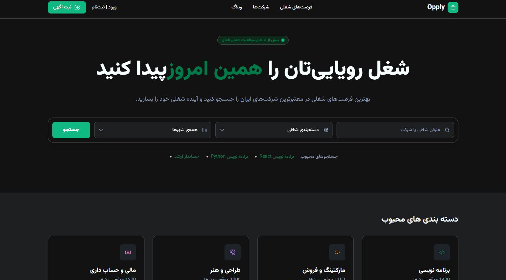

# Opply

**A modern, fully responsive job search platform** built with React, Vite & Tailwind CSS.

> Frontend showcase focused on clean UI, dark mode, and Tailwind best practices.

🌐 **Live Demo:** [https://opply-kappa.vercel.app](https://opply-kappa.vercel.app)

---

## screen shots




## Features

- Fully responsive design (Mobile / Tablet / Desktop)
- Dark Mode support
- Modern and minimal UI
- Job search section with filters
- Popular categories
- Featured (VIP) job cards
- Recent job listings
- Top employers section
- Blog / Articles section
- Call-to-action boxes for job seekers & employers
- Clean and reusable components

---

## Tech Stack

- **React 19**
- **Vite 8**
- **TypeScript**
- **Tailwind CSS v4**
- **React Icons**

---

## Getting Started

### 1. Clone the repository

```bash
git clone https://github.com/Mamziii/opply.git
cd opply
2. Install dependencies
Bashnpm install
3. Run the development server
Bashnpm run dev
4. Build for production
Bashnpm run build

Project Structure
Bashsrc/
├── components/     # UI components (Navbar, Header, Cards, Footer...)
├── App.tsx
├── main.tsx
└── index.css       # Tailwind + custom theme

Custom Theme
The project uses a custom color system defined with Tailwind v4 @theme:

Primary: Emerald Green
Full Light & Dark mode support
Custom background, text, card and border colors


Screenshots
You can add screenshots here later

Author
Mamziii

GitHub: github.com/Mamziii

License
This project is open source and available under the MIT License [blocked].
text